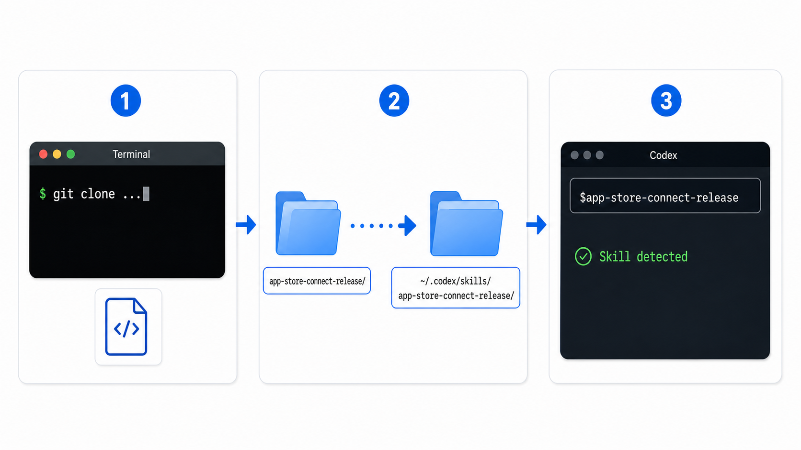
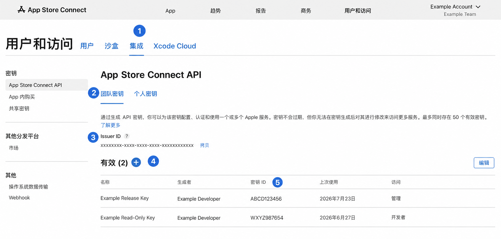
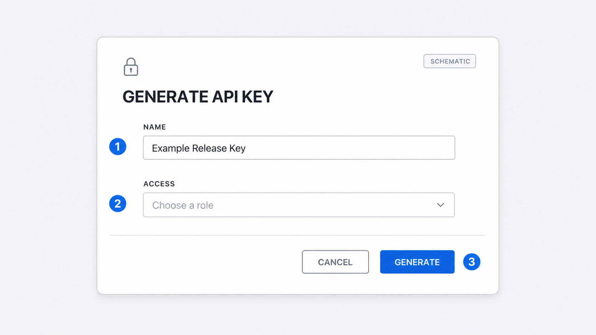
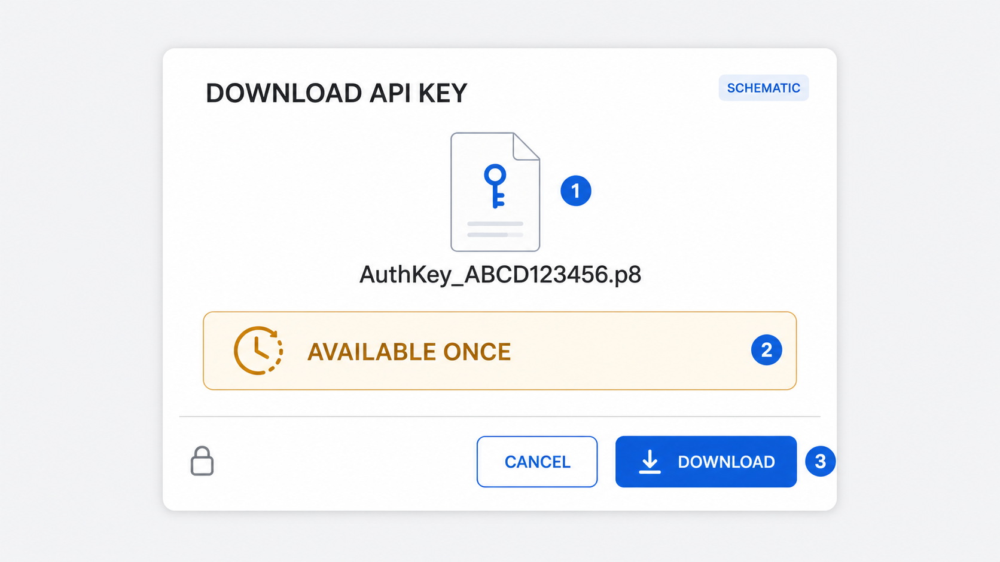
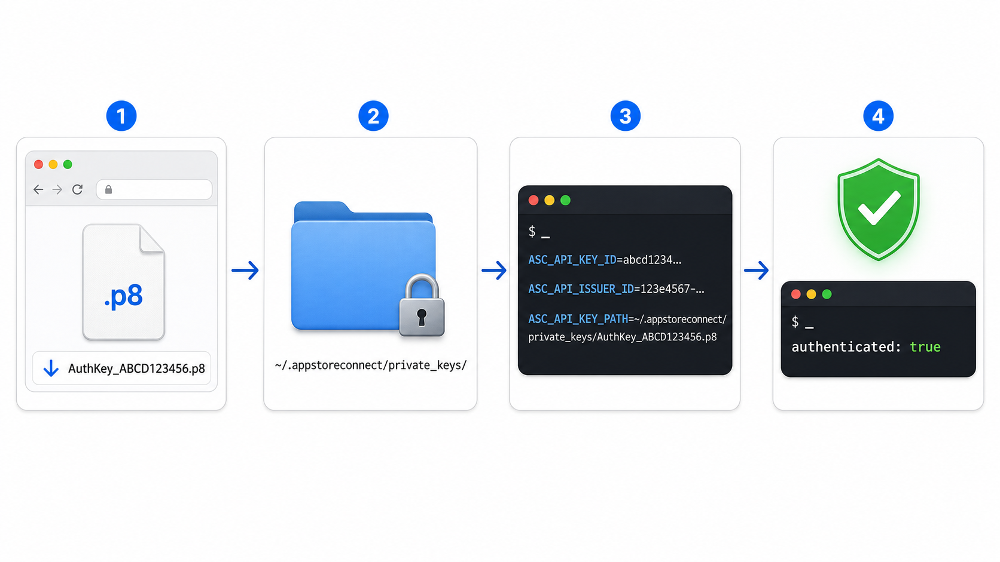
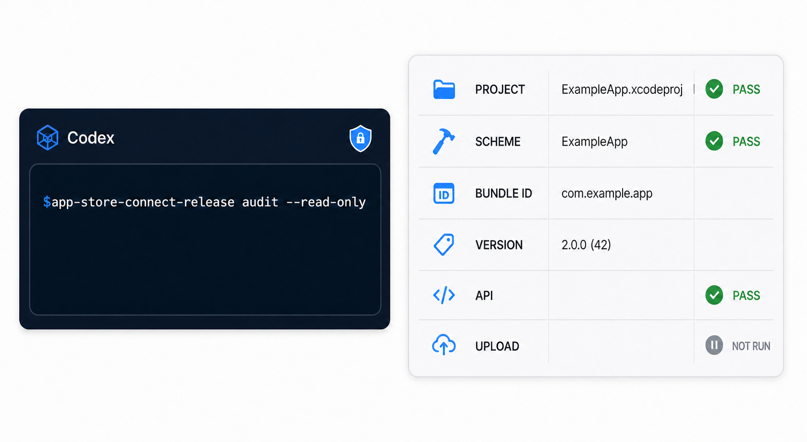
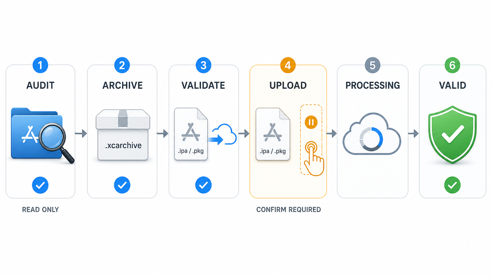
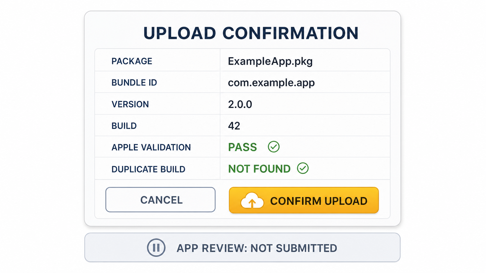

# App Store Connect Release：零基础图文教程

[English](../en/quick-start.md) | [简体中文](quick-start.md) | [日本語](../ja/quick-start.md) | [返回仓库首页](../../README.md)

这份教程假设你从未使用过 App Store Connect API Key。请严格按照顺序操作，先完成只读检查；在完全看懂报告之前，不要执行上传。

> 标有 `SCHEMATIC` 的图片是教学示意图，不是 Apple 界面的逐像素截图。Apple 可能调整页面布局，但图中字段和流程已经根据 Apple 官方文档核对。

## 先选择你要完成的路线

| 路线 | 最终结果 | 需要 API Key | 会修改 Apple 数据吗 |
| --- | --- | --- | --- |
| A | 检查本地 Xcode 项目 | 不需要 | 不会 |
| B | 查询 App Store Connect | 需要 | 不会 |
| C1 | 创建本地 Archive | 不需要 | 不会 |
| C2 | 使用 Apple 验证或上传 | 需要 | 只有确认上传后才会 |

新手应先完成路线 A，再继续路线 B。

## 第 0 步：准备条件

- 一台安装了 Xcode 的 Mac。
- 一个包含 `.xcodeproj` 或 `.xcworkspace` 的项目文件夹。
- Codex 能够访问该文件夹和终端。
- 路线 B 或 C2：你能在 App Store Connect 中访问这个 App。
- 创建团队 API Key：账号具有 Account Holder 或 Admin 权限。

只做本地只读审计时，不需要 API Key。

## 第 1 步：安装 Skill

打开终端并运行：

```sh
git clone https://github.com/Hubuguilai/app-store-connect-release.git app-store-connect-release-repo
mkdir -p "$HOME/.codex/skills/app-store-connect-release"
rsync -a app-store-connect-release-repo/app-store-connect-release/ \
  "$HOME/.codex/skills/app-store-connect-release/"
```



检查是否安装成功：

```sh
test -f "$HOME/.codex/skills/app-store-connect-release/SKILL.md" \
  && echo "Skill installed successfully"
```

预期结果：

```text
Skill installed successfully
```

安装后新建一个 Codex 任务，让 Codex 重新发现 Skill。

## 第 2 步：完成第一次本地只读审计

在 Codex 中打开包含 Xcode 项目的文件夹，然后复制下面的提示词：

```text
使用 $app-store-connect-release 检查这个 Xcode 项目。
只允许只读检查，不要 Archive、不要上传，也不要修改任何文件。
```

Codex 应该报告项目或 Workspace、Scheme、Bundle ID、开发团队、平台、版本号、构建号和签名配置。

成功标准：

- Codex 识别到 Skill；
- 找到正确的 Xcode 工程和 Scheme；
- 没有执行 Archive 或上传命令；
- 清楚列出缺少的准备条件。

如果你只需要检查本地项目，到这里就可以停止。路线 A 已经完成。

## 第 3 步：打开 API Key 页面

如果要查询 App Store Connect，请依次进入：

```text
App Store Connect → 用户和访问 → 集成
→ App Store Connect API → 团队密钥
```



图片中的编号表示：

1. 打开“集成”。
2. 选择“团队密钥”。
3. 复制 `Issuer ID`。
4. 点击 `+` 创建密钥。
5. 创建后的 `Key ID` 会显示在列表中。

如果页面显示“请求访问”，必须由 Account Holder 先申请 API 权限，Apple 会审核申请。如果看不到团队密钥或加号，请让 Account Holder 或 Admin 创建密钥。

## 第 4 步：生成团队 API Key

点击 `+` 或“生成 API 密钥”。



1. 输入便于识别的名称，例如 `Codex Release`。
2. 选择能够完成目标任务的最小权限角色。
3. 点击“生成”。

必须知道：

- Apple 规定团队密钥需要 Account Holder 或 Admin 权限。
- 团队密钥会应用于账号中的所有 App。
- 密钥名称和访问级别生成后不能修改。
- 如果以后需要不同角色，应撤销旧密钥并创建新密钥。

不要为了回避一次权限错误就直接选择更高权限。先使用能够完成任务的最小权限，只有 Apple 明确拒绝必要操作时再判断是否需要调整。

## 第 5 步：只下载一次 `.p8` 文件

密钥生成后，点击对应的下载链接。



1. 确认文件名类似 `AuthKey_<KEY_ID>.p8`。
2. 记住私钥只能下载一次。
3. 点击“下载”并安全保存。

Apple 不会保存可再次下载的副本。如果文件丢失或泄露，请立即撤销该密钥并重新创建。

绝对不要：

- 把私钥内容粘贴到 Codex 或 GitHub Issue；
- 把 `.p8` 提交到 Git；
- 把它放进 Xcode 项目；
- 通过邮件或聊天工具发送它。

## 第 6 步：保存并配置密钥

执行前先把 `YOUR_KEY_ID` 替换成真实 Key ID：

```sh
mkdir -p "$HOME/.appstoreconnect/private_keys"
mv "$HOME/Downloads/AuthKey_YOUR_KEY_ID.p8" \
  "$HOME/.appstoreconnect/private_keys/AuthKey_YOUR_KEY_ID.p8"
chmod 600 "$HOME/.appstoreconnect/private_keys/AuthKey_YOUR_KEY_ID.p8"
```

为当前终端会话设置三个变量：

```sh
export ASC_API_KEY_ID="YOUR_KEY_ID"
export ASC_API_ISSUER_ID="YOUR_ISSUER_ID"
export ASC_API_KEY_PATH="$HOME/.appstoreconnect/private_keys/AuthKey_YOUR_KEY_ID.p8"
```



不要把私钥内容写进环境变量。`ASC_API_KEY_PATH` 只应该保存私钥文件的路径。

如果希望以后继续使用，可以把三行 `export` 加入 `~/.zshrc`，然后重新启动终端和 Codex。

## 第 7 步：安全测试认证

运行下面的只读认证探测：

```sh
python3 "$HOME/.codex/skills/app-store-connect-release/scripts/asc_api_client.py" auth
```

预期结果：

```json
{
  "authenticated": true,
  "apps_returned": 1
}
```

`apps_returned` 的数字可能不同。如果是 `0`，请检查这个 Key 所属账号和角色是否能访问目标 App。

到这里，路线 B 的配置已经完成。

## 第 8 步：执行完整只读审计

在 Codex 中打开项目并复制：

```text
使用 $app-store-connect-release 执行完整的发布准备审计。
可以查询 App Store Connect，但不要修改元数据、截图、IAP、文件、
签名资源或构建，也不要上传任何内容。
```



确认报告中显示：

- 正确的项目和 Scheme；
- 正确的 Bundle ID；
- 计划发布的版本号和构建号；
- API 认证成功；
- `UPLOAD: NOT RUN`。

只要项目、Scheme、Bundle ID、版本号或构建号有一个不正确，就不要继续。

## 第 9 步：理解完整发布阶段



1. **AUDIT**：检查项目和 Apple 当前状态。
2. **ARCHIVE**：在本机生成 `.xcarchive`。
3. **VALIDATE**：让 Apple 验证导出的 `.ipa` 或 `.pkg`。
4. **UPLOAD**：只有确认后才真正上传。
5. **PROCESSING**：等待 Apple 处理构建。
6. **VALID**：构建已处理并可选择，但不代表通过 App Review。

每个阶段单独向 Codex下达任务。

只 Archive、不上传：

```text
使用 $app-store-connect-release 创建 Release Archive。
不要上传；除非已经说明并获得允许，否则不要更新 Provisioning。
```

只验证、不上传：

```text
使用 $app-store-connect-release 导出并让 Apple 验证新的 Archive。
不要上传。
```

只查询处理状态：

```text
使用 $app-store-connect-release 查询当前构建的处理状态，只读。
```

## 第 10 步：检查所有信息后再上传

只有审计和 Apple 验证均通过后才使用：

```text
使用 $app-store-connect-release 上传已经验证的发布包。
最终确认前，先显示准确的文件路径、Bundle ID、版本号、构建号、
Apple 验证结果和重复构建检查结果。不要提交 App Review。
```



确认上传前，亲自核对：

- 发布包文件名和路径；
- Bundle ID；
- Marketing Version；
- Build Number；
- Apple 验证已经通过；
- 没有发现重复构建。

上传需要 `--confirm-upload`。上传完成并不代表已经提交审核。

## 可以直接复制的提示词

本地只读检查：

```text
使用 $app-store-connect-release 检查这个项目，只读。
```

查询 Apple 状态：

```text
使用 $app-store-connect-release 检查 App Store Connect 中的版本、
构建、截图、元数据和 IAP 状态，不要应用任何修改。
```

预览元数据差异：

```text
使用 $app-store-connect-release 预览多语言元数据差异，不要应用。
```

预览一种语言的截图：

```text
使用 $app-store-connect-release 预览 en-US 截图差异，
不要上传、删除或替换任何图片。
```

不确定时，增加这句话：

```text
先展示计划，只执行只读检查。
```

## 常见问题

### `ASC_API_ISSUER_ID is required`

在当前终端重新运行三条 `export` 命令。如果已经写入 `~/.zshrc`，请重启终端和 Codex。

### `App Store Connect key file was not found`

检查准确路径：

```sh
ls -l "$HOME/.appstoreconnect/private_keys/AuthKey_YOUR_KEY_ID.p8"
```

文件名中的 Key ID 必须和 `ASC_API_KEY_ID` 相同。

### 看不到 `+` 或“生成 API 密钥”

团队密钥需要 Account Holder 或 Admin 权限。Account Holder 也可能尚未申请 App Store Connect API 访问权限。

### `Could not uniquely discover an Xcode workspace/project`

仓库包含多个 Xcode 工程。明确告诉 Codex 要发布哪个 App，或者提供具体 Workspace/Project 路径。

### `A unique scheme was not discovered`

让 Codex 列出所有 Scheme，然后明确选择需要发布的共享 Scheme。

### 重复构建保护阻止了命令

提高 Build Number。除非已经确认 Apple 为什么存在相同版本和构建号，否则不要绕过保护。

### Xcode 请求签名权限

解锁登录钥匙串并检查证书和描述文件。Provisioning 更新默认关闭，只有明确允许后才会启用。

## 仍然可能需要手动完成的门户操作

根据 App 和账号情况，App Store Connect 仍可能要求你完成协议、税务和银行资料、定价、销售地区、隐私问卷、出口合规、年龄分级、审核联系信息、选择构建、关联 IAP 和最终提交 App Review。

Skill 必须列出这些项目，不能因为构建已经上传就声称它们已经完成。

## Apple 官方资料

- [App Store Connect API 入门](https://developer.apple.com/help/app-store-connect/get-started/app-store-connect-api)
- [创建 App Store Connect API Key](https://developer.apple.com/documentation/appstoreconnectapi/creating-api-keys-for-app-store-connect-api)
- [角色权限](https://developer.apple.com/help/app-store-connect/reference/account-management/role-permissions/)

---

[返回仓库首页](../../README.md)
